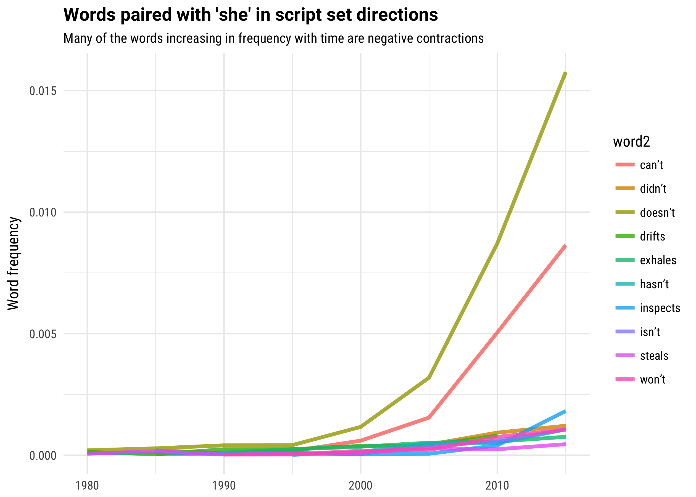
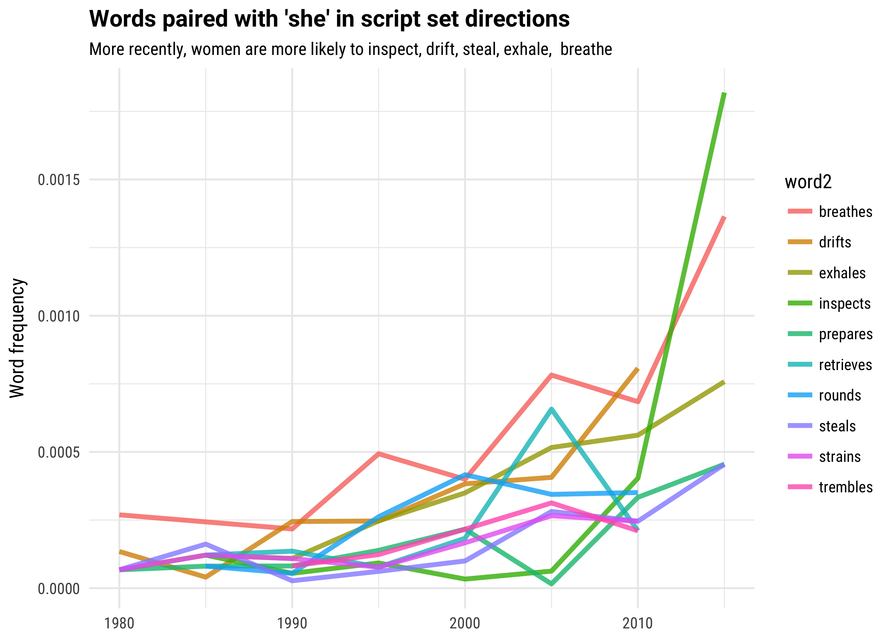
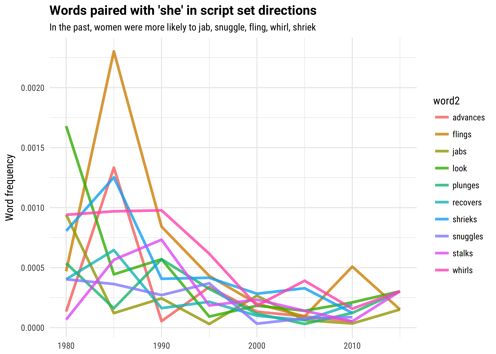

## Reading in the data


```
## # A tibble: 1,201,303 x 4
##    scriptID  line word1    word2
##       <int> <chr> <chr>    <chr>
##  1     1498    69    he    comes
##  2     1498   103    he   gently
##  3     1498   104    he    picks
##  4     1498   109    he    faces
##  5     1498   179    he  machine
##  6     1498   184    he dictator
##  7     1498   254    he       is
##  8     1498   257    he   labels
##  9     1498   257    he    makes
## 10     1498   258    he  brushes
## # ... with 1,201,293 more rows
```

## Joining the bigrams to other metadata about the scripts


What kind of joining can I do? Year, genre, gender of writers/etc


```
## # A tibble: 2,394,282 x 6
##    scriptID  line word1 word2      imdb     Genre
##       <int> <chr> <chr> <chr>     <chr>     <chr>
##  1     1502   152    he  goes tt0453562 Biography
##  2     1502   152    he  goes tt0453562     Drama
##  3     1502   152    he  goes tt0453562     Sport
##  4     1502   162    he tries tt0453562 Biography
##  5     1502   162    he tries tt0453562     Drama
##  6     1502   162    he tries tt0453562     Sport
##  7     1502   165    he never tt0453562 Biography
##  8     1502   165    he never tt0453562     Drama
##  9     1502   165    he never tt0453562     Sport
## 10     1502   664    he steps tt0453562 Biography
## # ... with 2,394,272 more rows
```

```
## # A tibble: 5,563,413 x 10
##    scriptID  line word1  word2      imdb     role       person_name gender    role_two important
##       <int> <chr> <chr>  <chr>     <chr>    <chr>             <chr>  <chr>       <chr>     <chr>
##  1     1498    69    he  comes tt0472033 director       Shane Acker   male         n/a         1
##  2     1498    69    he  comes tt0472033   writer    Pamela Pettler female  screenplay         1
##  3     1498    69    he  comes tt0472033   writer       Shane Acker   male       story         1
##  4     1498    69    he  comes tt0472033 producer Timur Bekmambetov   male    producer         1
##  5     1498    69    he  comes tt0472033 producer        Tim Burton   male    producer         1
##  6     1498    69    he  comes tt0472033 producer     Dana Ginsburg female    producer         1
##  7     1498    69    he  comes tt0472033 producer        Jim Lemley   male    producer         1
##  8     1498    69    he  comes tt0472033 producer      Marci Levine female co-producer         1
##  9     1498   103    he gently tt0472033 director       Shane Acker   male         n/a         1
## 10     1498   103    he gently tt0472033   writer    Pamela Pettler female  screenplay         1
## # ... with 5,563,403 more rows
```


## Change by year











