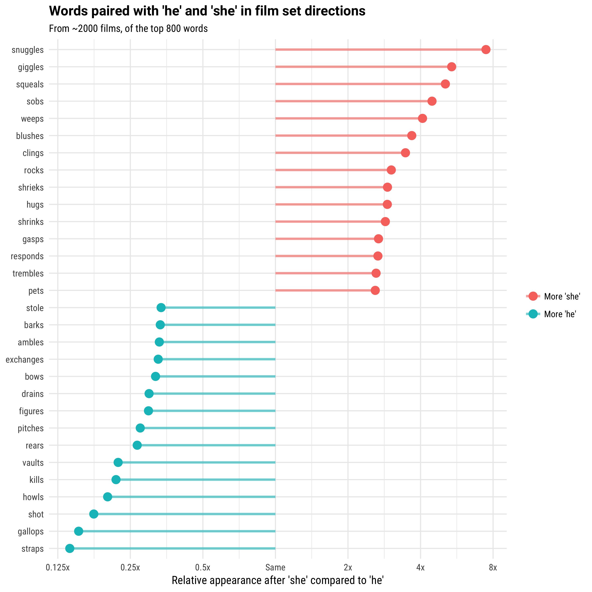
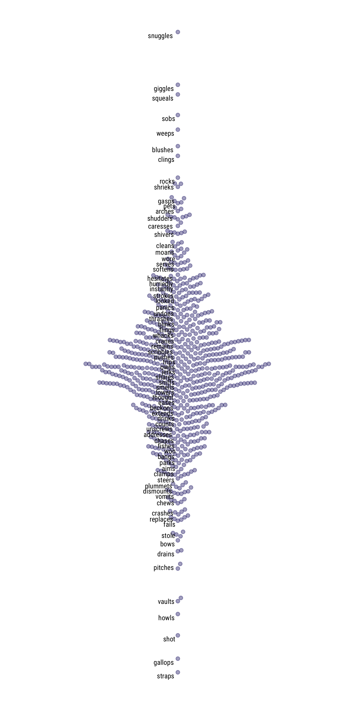
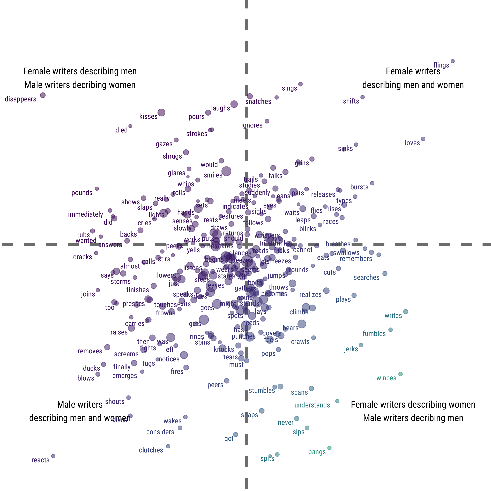

How are women portrayed in film? It’s complicated; that question might make you think of a male protagonist’s romantic interest, a damsel in distress who needs to be rescued, or Wonder Woman.

One way to quantitatively measure how women are portrayed in film is to look at scene directions in film scripts. Scene directions are the part of a script that are not dialogue, describing what’s happening on screen and telling actors how to move and how to deliver their lines.

**In this analysis, we used text mining to identify words that are paired with the pronouns “he” and “she” in scene directions for about 2,000 film scripts for movies released from the 1930s to today.** We then analyzed which words are more likely to come after one or the other.

There are dramatic differences in the kinds of words we see here. In movies, women are more likely to snuggle, giggle, squeal, and sob while men are more likely to strap things on, gallop, shoot, howl, and kill. We see evidence here of the tropes and storytelling conventions that propel so many films, and how men, women, and their relationships are often portrayed.

Now let’s look at the top 800 words, including those that are used about evenly after “he” and “she”.

*Really rough mock-up of general idea for main viz:*

*Label all the outlier points, choose interesting other points to label. For all labeled points, have example text for interactive hover. For non-labeled points, show word on hover.*

## Impact of writers

Hollywood can be a tough place to work as a creative woman, either writing, directing, or producing films. We used our text mining approach to explore the impact that the gender of a writer has on how characters are portrayed. Using IMDB biographies, pictures, and names, we manually classified the genders of writers for our film script dataset.

English has two singular third person pronouns most often used for people, “he” and “she”. In this analysis, for both the text data and the identification of gender for film writers, we have chosen to identify men and women with the pronouns “he” and “she”. Using this type of classification, anyone (writer or character) that uses the pronoun “she” would be classified as a woman. 

With these data, we can examine how male and female writers portray women in film. We can dig deeper into the kind of analysis we showed above and see how the results depend on who is writing a character. Do women writers portray women differently? What are the words that both male and female writers use about equally when crafting characters who are women, or men? What are the words that they use differently? How would the overall cultural representation of women be different if there were more women writing the movies we watch? For this part of the analysis, we will narrow the focus to the most commonly used 400 words.

*Rough mockup for viz of writer viz*

*Hover for word for all points*

In our dataset, about 15% of film writers were women and about 85% were men. If women were more equitably represented in the ranks of Hollywood writers, our analysis indicates we would see fewer female characters responding, kissing, and crying and more women spying, writing, and finding things. 

There are some words that both male and female writers are likely to use when directing a character of a certain gender.. We see that women in film are more likely, compared to male characters, to gasp, hurry, smile, hesitate, and stir (mostly while cooking), regardless of whether the writer is a man or a woman. Men in film are more likely, compared to women, to smash things, draw their weapons, grin, wink, point, talk *and* speak, when being written by both male and female screenwriters.

We can also see remarkable differences in how male and female writers portray characters who are men and women. When describing the opposite gender, both men and women use some overtly romantic and sexual words like “kiss”, and “stroke”, as well as more subtle words like “respond” and “embrace”. When writing for the opposite gender, writers also use words that imply, well, less happy outcomes, such as “cry”, “glare”, and “died”.

When characters are penned by an author of their same gender, they are more likely to wince, jerk, fumble, and perhaps most remarkably, write on screen. There are verbs here that are active but less explicitly testosterone-fueled than when writers create male characters; when writers create characters the same gender as themselves, these characters spy, scan, sprint, and climb. These characters also search, remember, and realize. A woman in a movie doing such things is a far cry from the giggling, squealing, blushing character we met at the beginning of this essay.

> The code used in analysis is [publicly available on GitHub](https://github.com/juliasilge/women-in-film). The data set for this analysis included 1,966 scripts for films released between 1929 and 2015; most are from 1990 and after. Each script was processed to extract only the set directions, excluding dialogue from this analysis. We then identified all [bigrams in these scripts that had either “he” or “she” as the first word in the bigram](https://juliasilge.com/blog/gender-pronouns). Then, we calculated a log odds ratio to find words that exhibit the biggest differences between relative use for “she” and “he”. We removed stop words and did some other minimal text cleaning to maintain meaningful results. We calculated the overall log odds ratio for the 800 most commonly used words, and then log odds ratios for only scripts with male writers and female writers for the 400 most commonly used words. Scripts often have more than one writer and could be counted in both categories. To learn more about text mining analyses like this one and how to perform them, [check out Julia’s book](http://tidytextmining.com). 

