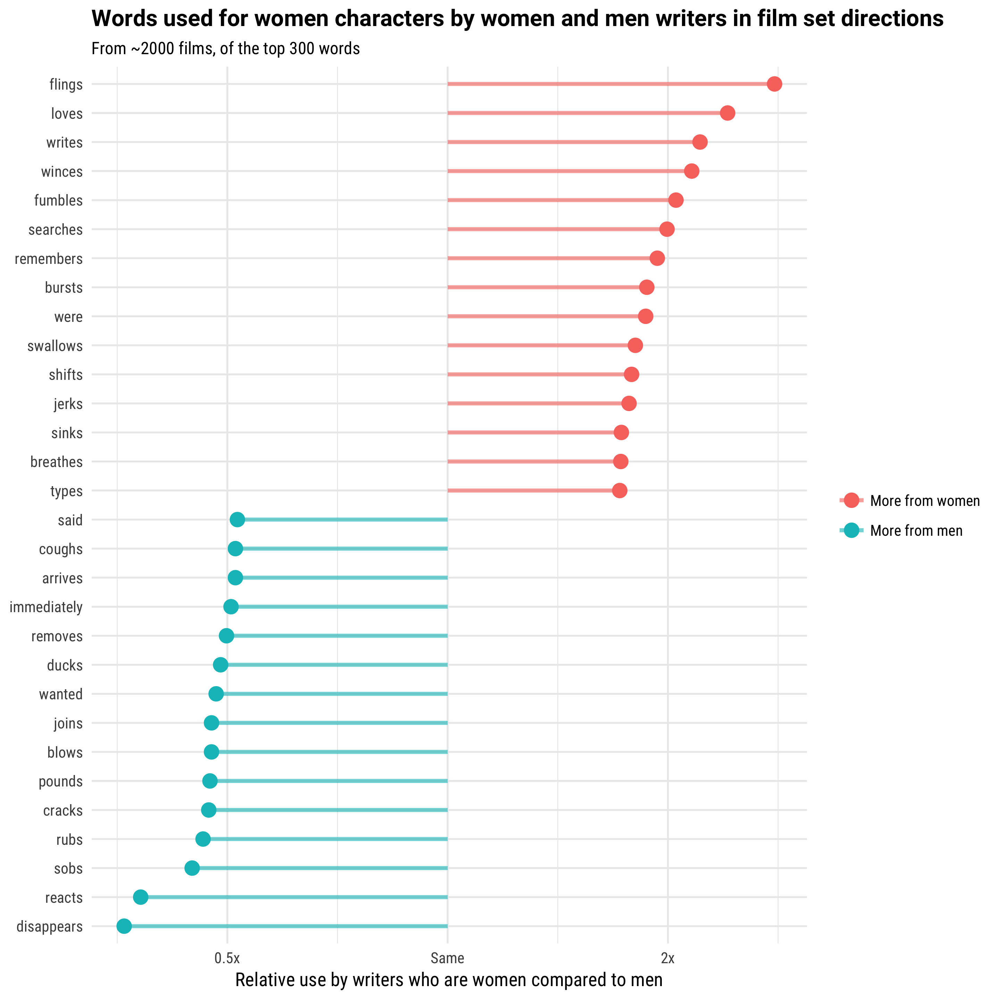
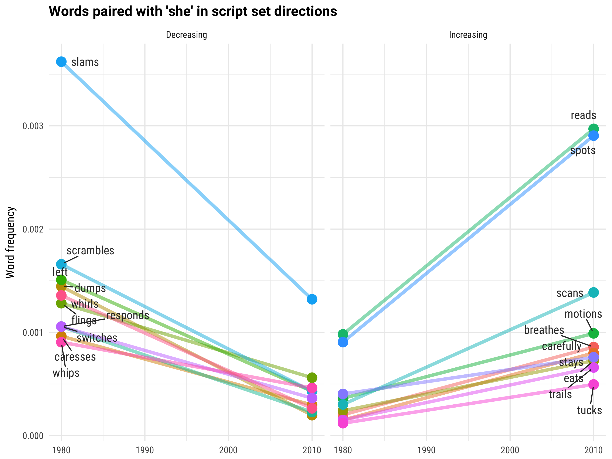
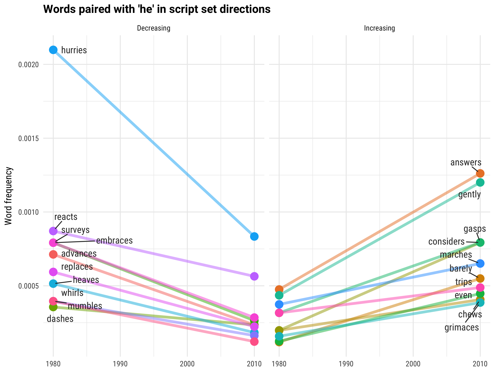

How are women portrayed in film? It's complicated; the question might make you think of a male protagonist's romantic interest, someone in trouble who needs to be rescued, or maybe Wonder Woman.

One way to quantitatively measure how women are portrayed in film is to look at scene directions in film scripts. Scene directions are the part of a script that are not dialogue, describing what's happening on screen and telling actors how to move and how to deliver their lines. These scene directions communicate to the actors, producers, and director what story the script is working to tell. 

*Really rough mock-up of general idea for main viz:*

*Label all the outlier points, choose interesting other points to label. For all labeled points, have example text for interactive hover. For non-labeled points, show word on hover.*

Example text snippets for "she squeals":

|text                                                        |
|:-----------------------------------------------------------|
|She squeals.  Business is over.  He carries her across      |
|He jumps on her. She squeals. He pretends to give her CPR.  |
|which is running the news with the sound muted. She squeals |
|She squeals, pained to leave her collection behind.         |
|up the techno music.  She squeals and bounces away.  Dodge  |
|He dumps cold champagne on her back.  She squeals and jumps |

## Impact of writers

*Rough mockup for viz of writer viz*

*Hover for word for all points*

Add bar plot for just how women are portrayed

## Word use changing with time

*interactively switch from men to women, increasing to decreasing*
